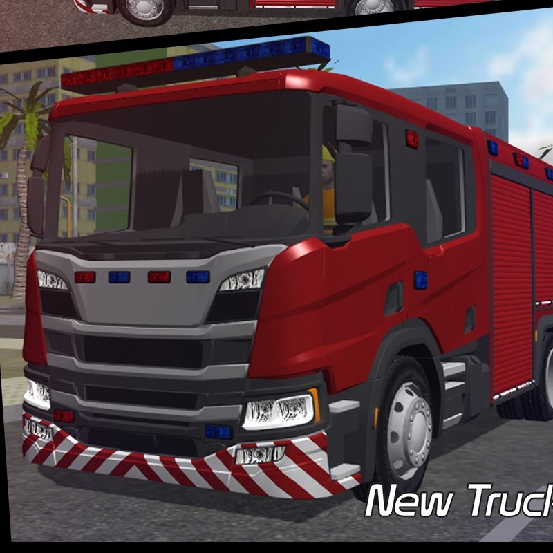
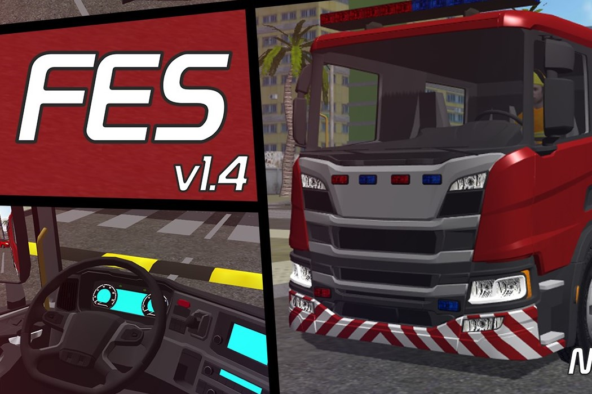

<header id="home">

<nav id="nav-wrap">[Show navigation](#nav-wrap "Show navigation") [Hide navigation](# "Hide navigation")

*   [Home](#home)
*   [About](#about)
*   [Resume](#resume)
*   [Works](#portfolio)
*   [Contact](#contact)

</nav>

# I'm Pupudu Liyanage

### I'm a software engineer, illustrator and webdesigner creating awesome and effective visual identities for companies of all sizes around the globe. Let's [start scrolling](#about) and learn more [about me](#about).

* * *

*   
*   
*   
*   
*   
*   
*   

</header>

<section id="about">

## About Me

I'm a person who is eager to learn new things and always tries to develop myself up to a better state than I was. I'm seeking a position in a growth-oriented company where I can use my skills to the advantage of the company while having the scope to develop my own skills.

## Contact Details

Pupudu Liyanage  
06, kolonna,  
Embilipitiya.  
+94 77 24 20 965  
pupuduliyanage@gmail.com

[Download Resume](images\portfolio\Doc\CV_pupudu_liyanage.pdf)

</section>

<section id="resume">

# Education

### University of Life

BSc. (Hons) in Computer Science(Specialized in Artificial Intelligence). • _2018 - Present_  
University of Kelaniya.

# Work

### Inova IT Systems (Pvt) Ltd

Software engineer • _June 20121 - Present_

### Super Cool Studio

UX Designer • _March 2020 - February 2021_

# Skillss

*   _JAVA_
*   _Spring Boot_
*   _PYTHON_
*   _CSS_
*   _HTML5_
*   _jQuery_

</section>

<section id="portfolio">

# Check Out Some of My Works.

[

##### pharmacy management system

Web Development

](#modal-01)

[

##### Console

Web Development

](#modal-02)

[

##### Judah

Webdesign

](#modal-03)

[

##### Into The Light

Photography

](#modal-04)

[

##### Farmer Boy

Branding

](#modal-05)

[

##### Fire Truck Game

Game Development

](#modal-06)

[

##### Origami

Illustrration

](#modal-07)

[

##### Retrocam

Web Development

](#modal-08)

#### pharmacy management system

A Pharmaceutical management system with point of sales and inventory control system. The project demonstrates object-oriented principles and database handling.

Java | MySQL | OOP | XAMPP | NetBeans

[Details](https://github.com/pubudu-sam) <a class="popup-modal-dismiss">Close</a>

#### Console

Proin gravida nibh vel velit auctor aliquet. Aenean sollicitudin, lorem quis bibendum auctor, nisi elit consequat ipsum, nec sagittis sem nibh id elit.

Branding, Web Development

[Details](http://srikrishnacommunication.com/Giridesigns.html) <a class="popup-modal-dismiss">Close</a>

#### Judah

Proin gravida nibh vel velit auctor aliquet. Aenean sollicitudin, lorem quis bibendum auctor, nisi elit consequat ipsum, nec sagittis sem nibh id elit.

Branding

[Details](http://srikrishnacommunication.com/Giridesigns.html) <a class="popup-modal-dismiss">Close</a>

#### Into the Light

Proin gravida nibh vel velit auctor aliquet. Aenean sollicitudin, lorem quis bibendum auctor, nisi elit consequat ipsum, nec sagittis sem nibh id elit.

Photography

[Details](http://srikrishnacommunication.com/Giridesigns.html) <a class="popup-modal-dismiss">Close</a>

#### Farmer Boy

Proin gravida nibh vel velit auctor aliquet. Aenean sollicitudin, lorem quis bibendum auctor, nisi elit consequat ipsum, nec sagittis sem nibh id elit.

Branding, Webdesign

[Details](http://srikrishnacommunication.com/Giridesigns.html) <a class="popup-modal-dismiss">Close</a>

#### Fire Truck Game

The Fire Truck is a multimedia game for entertain people. The project demonstrates Code Art principals.

Processing | Code Art

[Details](http://srikrishnacommunication.com/Giridesigns.html) <a class="popup-modal-dismiss">Close</a>

#### Origami

Proin gravida nibh vel velit auctor aliquet. Aenean sollicitudin, lorem quis bibendum auctor, nisi elit consequat ipsum, nec sagittis sem nibh id elit.

Branding, Illustration

[Details](http://srikrishnacommunication.com/Giridesigns.html) <a class="popup-modal-dismiss">Close</a>

#### Retrocam

Proin gravida nibh vel velit auctor aliquet. Aenean sollicitudin, lorem quis bibendum auctor, nisi elit consequat ipsum, nec sagittis sem nibh id elit.

Webdesign, Photography

[Details](http://srikrishnacommunication.com/Giridesigns.html) <a class="popup-modal-dismiss">Close</a>

</section>

<section id="contact">

# Get In Touch.

Sed ut perspiciatis unde omnis iste natus error sit voluptatem accusantium doloremque laudantium, totam rem aperiam,eaque ipsa quae ab illo inventore veritatis et quasi architecto beatae vitae dicta sunt explicabo. Nemo enim ipsam voluptatem quia voluptas sit aspernatur aut odit aut fugit.

<form action="" method="post" id="contactForm" name="contactForm">

<fieldset>

<label for="contactName">Name *</label> <input type="text" value="" size="35" id="contactName" name="contactName">

<label for="contactEmail">Email *</label> <input type="text" value="" size="35" id="contactEmail" name="contactEmail">

<label for="contactSubject">Subject</label> <input type="text" value="" size="35" id="contactSubject" name="contactSubject">

<label for="contactMessage">Message *</label><textarea cols="50" rows="15" id="contactMessage" name="contactMessage"></textarea>

<button class="submit">Submit</button>  

</fieldset>

</form>

Error boy

Your message was sent, thank you!  

<aside class="four columns footer-widgets">

#### Address and Phone

Pupudu LIyanage  
06 kolonna  
Embilipitiya.  
+94 77 24 20 965

#### Latest Tweets

*   This is Photoshop's version of Lorem Ipsum. Proin gravida nibh vel velit auctor aliquet. Aenean sollicitudin, lorem quis bibendum auctor, nisi elit consequat ipsum **[2 Days Ago](#)**
*   Sed ut perspiciatis unde omnis iste natus error sit voluptatem accusantium doloremque laudantium, totam rem aperiam, eaque ipsa quae ab illo inventore veritatis et quasi **[3 Days Ago](#)**

</aside>

</section>

<footer>

*   
*   
*   
*   
*   
*   
*   

*   Ceevee © Copyright 2016
*   Design by [Giri Designs](http://srikrishnacommunication.com/Giridesigns.html "Styleshout")

</footer>

